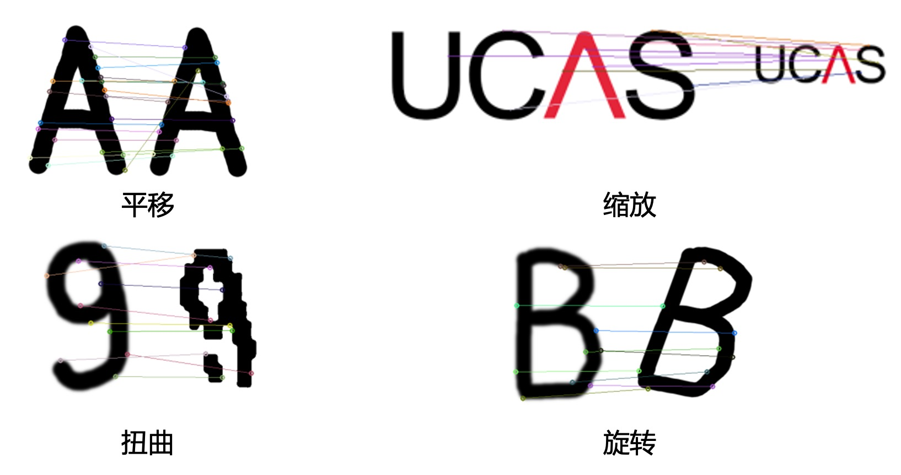

# Shape Context Matching

国科大2021-2022秋季学期 工业视觉检测 课程大作业报告

形状上下文匹配

Shape Context Matching

## Introduction

这个工作的背景，是中国科学院大学课程中，来自中科院自动化所刘智勇研究员的工业视觉检测的一个大作业。

> 实现Shape Context形状匹配算法（代码要求自行实现，匹配部分可利用已有算法）并实验分析。

这里我要感谢我的好搭档李嫣同学。当时做这个作业时正好与我投稿CVPR2022的时间有交错，因为李嫣同学整理的详细资料让我在实现算法时效率非常快，基本有效时间2小时变解决了这个问题。有时候一个好的队友真的非常非常的重要，胜于强大的本身。

## Demo

代码在[shape_context_matching.ipynb](https://github.com/RuoyuChen10/Shape_Context_Matching/blob/main/shape_context_matching.ipynb)中，一个教程式的代码，非常的简单，按照上面流程依次运行即可。

注意，需要安装的库（正常的版本应该都可以的）：
> opencv-python
> 
> numpy
> 
> scipy
> 
> matplotlib

## report

我们汇报的工作请见文件夹[PPT](./ppt/)
